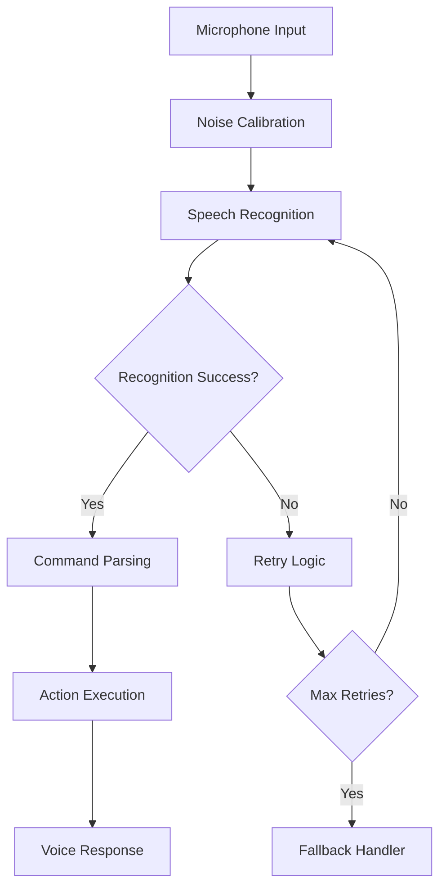

# 🎤 Rishi Voice Assistant

[](https://www.python.org/downloads/)
[](https://www.apple.com/macos/)
[](LICENSE)
[]()

A sophisticated, multi-functional voice-activated desktop assistant built in Python that can perform diverse tasks through natural language voice commands. Named "Rishi," this assistant integrates advanced speech recognition, system control, communication features, and smart automation capabilities.

## 🚀 Key Highlights

- 🎯 **Intelligent Voice Recognition** with noise calibration and fallback systems
- 🌐 **Web Automation** and intelligent search capabilities
- 📧 **Smart Email Management** with contact integration
- 💻 **System Control** for macOS (Bluetooth, WiFi, apps, power)
- 📱 **Communication Features** (SMS, Instagram integration)
- 🤚 **Gesture Control** for enhanced interaction
- ⚙️ **Modular Architecture** with comprehensive error handling
- 🔒 **Security-Focused** configuration management

## 🌟 Complete Feature Set

### 🔊 Advanced Voice Interaction
- **Speech-to-Text**: Google Speech Recognition with EN-US and EN-IN fallbacks
- **Text-to-Speech**: Customizable pyttsx3 engine with "Rishi" voice
- **Smart Recognition**: Automatic noise calibration and ambient adjustment
- **Optimized Processing**: Configurable timeouts, retry mechanisms, and confidence validation
- **Multi-Modal Input**: Quick commands vs. extended listening modes

### 🌐 Web Automation & Search
- **Smart Web Browsing**: Chrome/Brave browser integration
- **Intelligent Search**: Google, YouTube, Wikipedia with voice summaries
- **Website Shortcuts**: Direct access to YouTube, Google, Stack Overflow
- **Music Integration**: Spotify web player automation
- **URL Processing**: Safe browser handling with error recovery

### 📧 Comprehensive Email System
- **Voice-to-Email**: Natural language email composition
- **Smart Contact Management**: Name-based contact lookup with partial matching
- **Secure SMTP**: SSL/TLS encrypted email sending
- **Gmail Integration**: App-specific password support
- **Contact Directory**: Comprehensive contact database with easy management

### 💻 System Control & Automation
- **Application Management**: Open, close, show, and list installed apps
- **Power Control**: System shutdown and restart commands
- **Bluetooth Control**: Toggle, list devices, system profile access
- **WiFi Management**: Network scanning and connection info
- **Process Management**: Advanced app lifecycle control with psutil

### 📱 Communication & Social Media
- **SMS Integration**: Twilio-powered text messaging
- **Instagram Automation**: Bot integration for social media tasks
- **Contact Sync**: Unified contact management across platforms
- **Notification System**: Real-time communication alerts

### 🤚 Gesture & Input Control
- **macOS Gestures**: System-level gesture recognition
- **Window Management**: Swipe controls for desktop navigation
- **AppleScript Integration**: Native macOS automation support

### 🔍 Information & Research
- **Wikipedia Integration**: Voice-activated research with audio summaries
- **Real-time Search**: Intelligent query processing and results
- **Knowledge Base**: Extensible information retrieval system

## 🛠️ Installation & Setup

### System Requirements

- **Operating System**: macOS (primary), Linux/Windows (limited support)
- **Python Version**: 3.7 or higher
- **Hardware**: Microphone, speakers/headphones
- **Network**: Internet connection for cloud services
- **Browser**: Chrome or Brave Browser

### Quick Installation

```bash
# Clone the repository
git clone https://github.com/yourusername/SpeakingAssistant.git
cd SpeakingAssistant

# Install Python dependencies
pip install -r requirements.txt

# Install minimal dependencies (alternative)
pip install -r requirements-minimal.txt

# Install macOS system utilities
brew install blueutil portaudio
```

### Dependencies Overview

**Core Dependencies:**
```txt
pyttsx3>=2.90              # Text-to-speech engine
SpeechRecognition>=3.10.0   # Speech recognition
wikipedia>=1.4.0            # Wikipedia API
colorama>=0.4.6             # Terminal colors
psutil>=5.9.0               # System process management
python-dotenv>=1.0.0        # Environment management
```

**Communication:**
```txt
twilio>=8.2.0               # SMS/Phone functionality
instabot>=0.117.0           # Instagram automation
```

**Audio Processing:**
```txt
pyaudio>=0.2.11             # Microphone access
```

## ⚙️ Configuration

### Environment Setup

Create a `.env` file in the project root:

```env
# Email Configuration (Required)
EMAIL_ADDRESS=your_email@gmail.com
EMAIL_PASSWORD=your_app_specific_password
SMTP_SERVER=smtp.gmail.com
SMTP_PORT=587

# Voice Configuration (Optional)
SPEECH_RATE=160
VOICE_NAME=Rishi

# API Keys (Optional)
WOLFRAM_API_KEY=your_wolfram_key
WEATHER_API_KEY=your_weather_key

# Twilio Configuration (Optional)
TWILIO_ACCOUNT_SID=your_account_sid
TWILIO_AUTH_TOKEN=your_auth_token
```

### Email Setup (Gmail)

1. **Enable 2-Factor Authentication** on your Gmail account
2. **Generate App Password**: Google Account → Security → App passwords
3. **Use App Password**: Set as `EMAIL_PASSWORD` in `.env` file

### Contact Management

The assistant includes a pre-configured contact database in `contacts.py`. Add your contacts:

```python
self.contacts = {
    'contact_name': 'email@example.com',
    # Add more contacts here
}
```
## 🚀 Usage & Voice Commands

### Starting the Assistant

```bash
# Basic startup
python SpeakAssistant.py

# With logging
python -u SpeakAssistant.py 2>&1 | tee assistant_session.log
```

### Complete Voice Command Reference

#### 🌐 Web Browsing & Search
| Command | Description | Example |
|---------|-------------|--------|
| "Open YouTube" | Launch YouTube website | Direct browser opening |
| "Open Google" | Launch Google homepage | Direct browser opening |
| "Open Stack Overflow" | Developer Q&A platform | Direct browser opening |
| "Search [query]" | Google web search | "Search Python tutorials" |
| "Search Google [query]" | Explicit Google search | "Search Google machine learning" |
| "Search YouTube [query]" | YouTube video search | "Search YouTube cooking recipes" |
| "Wikipedia [topic]" | Research with audio summary | "Wikipedia artificial intelligence" |

#### 📧 Email & Communication
| Command | Description | Process |
|---------|-------------|--------|
| "Send email" | Voice-to-email workflow | Name recipient → Dictate content → Send |
| "List contacts" | Show contact directory | Displays all available contacts |

**Email Workflow Example:**
1. Say: "Send email"
2. Assistant: "Name the Receiver"
3. You: "Sundaram" (or any contact name)
4. Assistant: "What should I say?"
5. You: Dictate your message
6. Email sent automatically!

#### 🎵 Media & Entertainment
| Command | Description | Action |
|---------|-------------|--------|
| "Play music" | Open music streaming | Launches Spotify web player |
| "Play song" | Music playback | Contextual music commands |

#### 💻 System Control
| Command | Description | System Action |
|---------|-------------|--------|
| "Shutdown" | Power down system | Initiates system shutdown |
| "Restart" | Reboot system | Initiates system restart |
| "Bluetooth on" | Enable Bluetooth | macOS Bluetooth activation |
| "Bluetooth off" | Disable Bluetooth | macOS Bluetooth deactivation |
| "Bluetooth show/list" | List BT devices | System Bluetooth profile |
| "Scan WiFi" | Network scanning | Available WiFi networks |

#### 🖥️ Application Management
| Command Pattern | Description | Examples |
|-----------------|-------------|----------|
| "Open [app]" | Launch application | "Open Terminal", "Open Safari" |
| "Close [app]" | Terminate application | "Close Terminal", "Close Chrome" |
| "Show apps" | List installed apps | Displays all available applications |

**Supported Applications:**
- System apps: Terminal, Safari, Mail, Calendar, Notes
- Third-party apps: Chrome, Brave, WhatsApp, Telegram
- Developer tools: Xcode, VS Code, etc.

#### 🤚 Gesture Controls
| Command | Description | macOS Action |
|---------|-------------|--------|
| "Swipe left" | Navigate left | Mission Control left workspace |
| "Swipe right" | Navigate right | Mission Control right workspace |

#### 🤖 Assistant Identity
| Command | Response |
|---------|----------|
| "What's your name?" | "I am Rishi, a voice assistant" |
| "Who are you?" | Detailed capability description |

### Advanced Features

#### 🔄 Multi-Attempt Recognition
- **Smart Retry**: Automatically retries failed speech recognition
- **Fallback Languages**: EN-US primary, EN-IN secondary
- **Timeout Handling**: Different timeouts for quick vs. extended commands
- **Confidence Validation**: Ensures recognition accuracy

#### 🎯 Context-Aware Processing
- **Command Parsing**: Intelligent keyword matching with priority ordering
- **Partial Matching**: Flexible command interpretation
- **Error Recovery**: Graceful handling of unrecognized commands

## 📁 Project Architecture
```
SpeakingAssistant/
├── 🎤 SpeakAssistant.py      # Main application & command processing
├── 📧 email_handler.py       # Secure email functionality
├── 📞 contacts.py           # Contact management system
├── ⚙️ config.py              # Configuration management
├── 🤚 gestures.py          # macOS gesture controls
├── 🖥️ openApp.py           # Application lifecycle management
├── 📱 phone-call.py        # Twilio SMS/call integration
├── 📷 instagram.py         # Social media automation
├── 📄 requirements.txt       # Complete dependency list
├── 📄 requirements-minimal.txt # Essential dependencies only
├── 📁 voice_assistant.log  # Application logs
└── 📄 README.md           # This documentation
```

### Module Responsibilities

| Module | Primary Function | Key Features |
|--------|------------------|-------------|
| **SpeakAssistant.py** | Core engine | Speech I/O, command routing, main loop |
| **config.py** | Settings management | Environment variables, secure config |
| **email_handler.py** | Email operations | SMTP, SSL/TLS, Gmail integration |
| **contacts.py** | Contact database | Name lookup, contact CRUD operations |
| **openApp.py** | App control | Launch/terminate, app discovery |
| **gestures.py** | System gestures | macOS workspace navigation |
| **phone-call.py** | Telecommunications | SMS via Twilio, notification system |
| **instagram.py** | Social media | Instagram bot automation |
```

## 🔧 Technical Architecture

### Core Design Principles
- **Modular Architecture**: Each functionality isolated in dedicated modules
- **Command-Driven Interface**: Dictionary-based command mapping with priority handling
- **Fault-Tolerant Design**: Comprehensive error handling and graceful degradation
- **Security-First**: Environment-based configuration with secure credential management
- **Performance-Optimized**: Smart caching, timeout management, and resource optimization

### Speech Processing Pipeline



### Command Processing System

1. **Speech Capture**: Microphone → Audio buffer → Noise filtering
2. **Recognition**: Google Speech API → Language fallbacks → Confidence validation  
3. **Parsing**: Keyword matching → Priority sorting → Handler selection
4. **Execution**: Module dispatch → Error handling → Response generation
5. **Feedback**: TTS synthesis → Audio output → Visual logging

### Key Technical Components

| Component | Technology | Purpose | Features |
|-----------|------------|---------|----------|
| **Speech Engine** | Google Speech API | Voice recognition | Multi-language, cloud-based |
| **TTS Engine** | pyttsx3 | Voice synthesis | Offline, customizable voices |
| **Config Manager** | python-dotenv | Settings | Secure env var handling |
| **Email System** | smtplib + SSL | Communication | Encrypted SMTP, Gmail integration |
| **Process Control** | psutil | System management | Cross-platform process handling |
| **Web Automation** | webbrowser + urllib | Browser control | Safe URL handling |
| **Gesture Control** | AppleScript | macOS integration | System-level automation |

### Performance Optimizations

#### Speech Recognition
- **Energy Threshold**: 4000 (optimized for clarity)
- **Dynamic Adjustment**: Auto-calibration for ambient noise
- **Timeout Configuration**: 3s standard, 6s for extended input
- **Phrase Limits**: 5s maximum continuous speech
- **Retry Strategy**: 2 attempts with exponential backoff

#### Memory & Resource Management
- **Singleton Patterns**: Global recognizer and handlers
- **Lazy Loading**: Modules loaded on-demand
- **Connection Pooling**: Reusable SMTP connections
- **Cache Strategy**: Browser registration and app discovery caching

## 🎨 User Interface

The assistant provides:
- **Colorful Console Output**: Color-coded status messages
- **Visual Feedback**: Real-time processing indicators
- **Audio Feedback**: Voice confirmations and responses
- **Progress Indicators**: Command processing status

## 🔒 Security & Privacy

- **Local Processing**: Most operations run locally
- **Secure Email**: Uses secure email protocols
- **Privacy Focused**: No unnecessary data collection
- **Permission Based**: Requires explicit permissions for system operations

## 🐛 Troubleshooting

### Common Issues

**Microphone Not Working:**
- Check microphone permissions in System Preferences
- Ensure microphone is not muted
- Run microphone calibration

**Speech Recognition Errors:**
- Check internet connection
- Speak clearly and at moderate pace
- Reduce background noise

**Email Not Sending:**
- Verify email configuration
- Check internet connection
- Ensure email credentials are correct

**Browser Not Opening:**
- Install Chrome or Brave browser
- Check browser installation path
- Verify browser permissions

## 📝 Logging

The assistant creates detailed logs in `voice_assistant.log` including:
- Command recognition events
- Error occurrences
- System operations
- Performance metrics

## 🤝 Contributing

1. Fork the repository
2. Create a feature branch
3. Make your changes
4. Add tests if applicable
5. Submit a pull request

## 📄 License

This project is open source. Please check the license file for details.

## 🔮 Future Enhancements

- [ ] Multi-language support
- [ ] Custom wake word detection
- [ ] Home automation integration
- [ ] Calendar and reminder functionality
- [ ] Weather information
- [ ] News briefings
- [ ] Smart home device control

## 📞 Support

For issues, questions, or contributions:
- Create an issue in the repository
- Check the troubleshooting section
- Review the logs for error details

---

**Note**: This assistant is optimized for macOS. Some features may require adaptation for Windows or Linux systems.

## 🎯 Quick Start Guide

1. **Install Python 3.7+**
2. **Install dependencies**: `pip install -r requirements.txt`
3. **Configure email settings** in `email_handler.py`
4. **Run the assistant**: `python SpeakAssistant.py`
5. **Say "Hello"** to begin interaction
6. **Try commands** like "Open YouTube" or "What's your name?"

Enjoy your personal voice assistant! 🎉
